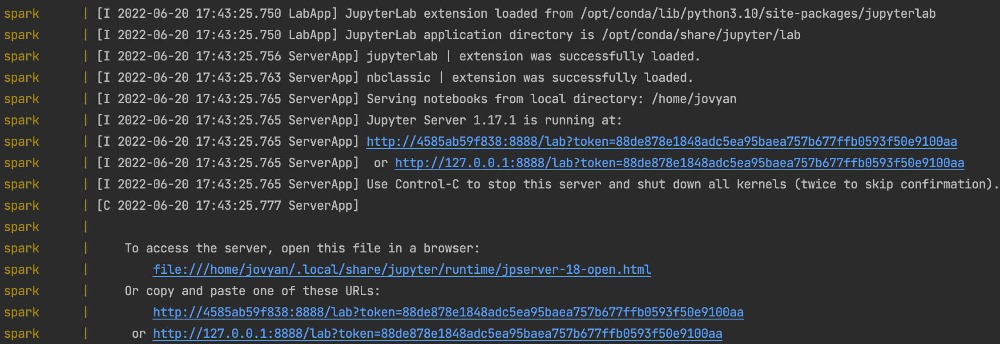
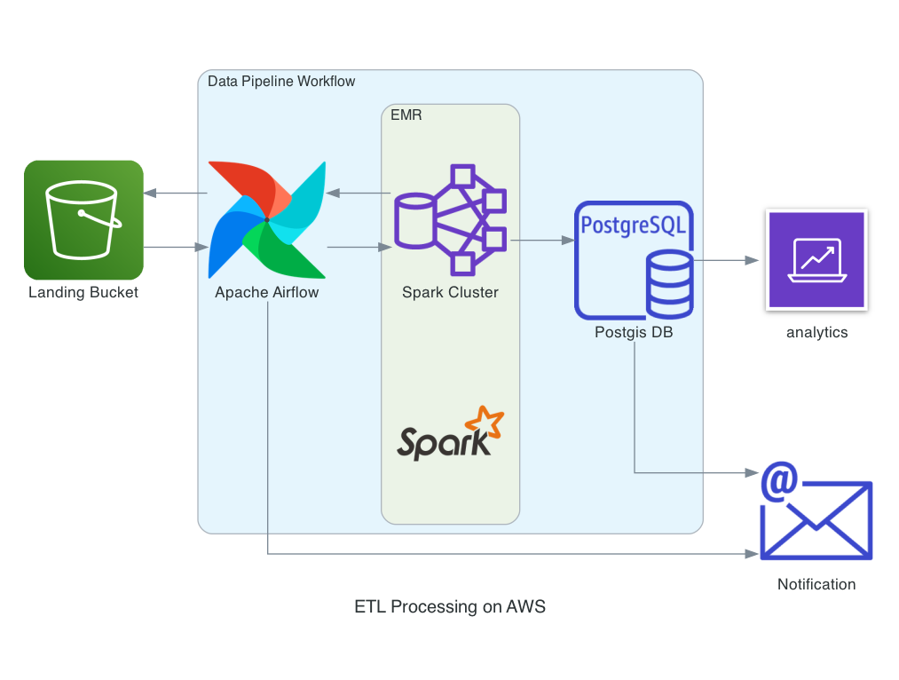

# Data Engineering Trips ETL and Analytics

This solution builds an automatic process to ingest data on an on-demand basis. 

The data to be ingested represents trips taken by different vehicles, and includes a city, a point of origin and a destination.
[This CSV file](data/input/trips.csv) is a sample of the data this solution handles.

This is what the data looks like:

|region|origin_coord|destination_coord|datetime|datasource|
|---|---|---|---|---|
|Prague|POINT (14.4973794438195 50.00136875782316)|POINT (14.43109483523328 50.04052930943246)|2018-05-28 09:03:40|funny_car|
|Turin|POINT (7.672837913286881 44.9957109242058)|POINT (7.720368637535126 45.06782385393849)|2018-05-21 02:54:04|baba_car|
|Prague|POINT (14.32427345662177 50.00002074358429)|POINT (14.47767895969969 50.09339790740321)|2018-05-13 08:52:25|cheap_mobile|
|Turin|POINT (7.541509189114433 45.09160503827746)|POINT (7.74528653441973 45.02628598341506)|2018-05-06 09:49:16|bad_diesel_vehicles|
|Turin|POINT (7.614078119815749 45.13433106465422)|POINT (7.527497142312585 45.03335051325654)|2018-05-23 12:45:54|pt_search_app|

### Tools and technologies used
 - Apache Spark version 3.2.1
 - Jupyter Notebook Python
 - Postgres 13 with PostGIS

The environment with all its dependencies are containerized and were built using the following Docker images:
 - [postgis/postgis](https://registry.hub.docker.com/r/postgis/postgis)
 - [jupyter/pyspark-notebook](https://hub.docker.com/r/jupyter/pyspark-notebook)

### How to run
1. Clone this repo:
```
git clone https://github.com/alexfmonteiro/de-trips.git
cd de-trips
```
2. Run the following command to build and run the containers:

```
docker-compose up --build
``` 
or 
```
make start
```

3. Run the ETL job to ingest the sample data:

```
docker exec spark spark-submit ./jobs/trips_etl.py
``` 
or 
```
make run
```


Alternatively, if you want to run the ETL job to ingest other files (e.g. `./data/input/trips_2.csv`), pass the file to tha application name like this:
```
docker exec spark spark-submit ./jobs/trips_etl.py ./data/input/trips_2.csv
```

### How to run Jupyter Notebooks
After starting the docker images (`docker-compose up`) you will see some similar logs like these in the console:



Click in one of the links like this one: `http://127.0.0.1:8888/lab?token=88de878e1848adc5ea95baea757b677ffb0593f50e9100aa`
Now you can run the [reports notebook](./notebooks/reports.ipynb) or create new ones.

### Main features
 - an automated process to ingest CSV files and store the data in a spatial SQL database (Postgis)
 - data cleaning step to detect and drop duplicates in the file being ingested
 - idempotency: the same data ingested will produce the outcome in the final trips table
 - data quality steps to enrich the data being ingested:
   - enforce data types
   - add input_file_name column for upserting logic
   - add time of the day column for partitioning and improved performance
 - high scalability due to Apache Spark parallel processing and containerized architecture
 - [reports notebook](./notebooks/reports.ipynb) providing analytics like:
   - daily/monthly/weekly average number of trips for a region
   - latest datasource from the two most commonly appearing regions
   - regions where a specific datasource appeared in
   - queries with bounding boxes
   - trips plotted

### How it works and main assumptions
The `spark` docker image runs an Apache Spark cluster, and it is ready to run a pyspark job.

When running the job through the `make run`command, it triggers the spark-submit cli to execute the spark job `trips_etl.py` in the `jobs` directory.

The trips_etl.py job will then ingest the csv file sent as an argument or configured in the [cfg file](./config/dl.cfg). These are the main processing steps:

1. Extract: CSV file is loaded in a spark dataframe and the Data Types for the entity `trips` are enforced;
2. Transform: 
   1. Metadata column added with the input file name;
   2. Duplicates are discarded;
   3. Coordinates strings are split into separate lat/long origin/destination columns;
   4. Data types for new columns are enforced;
3. Load transformed data to Postgres staging table
4. Data from staging table is upserted into a Postgres Spatial table, with support to geographical coordinates

Checks are performed in all the steps to make sure all rows from the new file were correctly ingested, and all the processing steps are logged in the console.

In step 4, the choice to use upsert logic is to make the pipeline prepared to ingest new recurring files on a schedule. This processing step runs inside Postgres instance using SQL only command.

The input_file_name column was added to make each ETL Job run idempotent.

### Further discussion about Usability and Scalability
 - When running the ETL job in the console, it is possible to follow through the logs the current status of the ingestion processing in all the steps. More details about the pipeline steps and the data being ingested could be achieved with Apache Airflow orchestration features.
 - Running locally with the selected containers architecture, the ingestion of a CSV file with 10 million lines took around 13 minutes. If more performance is needed, a bigger Spark cluster would need to be set, locally or in a cloud provider. 
 - It's important to note that the current solution already supports parallel processing since it's using Apache Spark.

### Deploying in a cloud provider

In a scenario where scalability is needed, an alternative would be to deploy this solution to the cloud. I would set up the following architecture on AWS:



Airflow would orchestrate the whole data pipeline workflow by:
1. monitoring the landing bucket in S3 for new file drops
2. triggering the Spark job in AWS EMR cluster with the new file to be ingested
3. each Airflow task would have retry mechanisms in place to make the data pipeline more robust
4. notifications via email can be set for failed tasks, or when the pipeline is completed successfully (represented by the email icon). Notification messages could also be sent via slack, if needed.

By design, each Airflow Dag run would ingest a single file. Multiple dag runs would be triggered for each new file for increased parallel processing.

The data in Postgres DB can be consumed by any Analytics/Dashboards tools like Tableau, Power BI or Amazon Quicksight.
